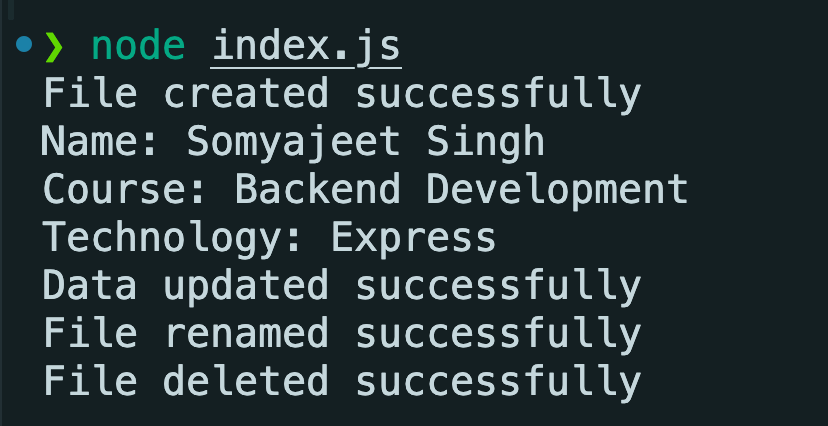

# File System Assignment

## Assignment Explanation

This project demonstrates basic file operations in Node.js using the `fs` module.

The program performs the following operations:

- Creates a file using `writeFile()`
- Reads the file using `readFile()`
- Adds data using `appendFile()`
- Renames the file using `rename()`
- Deletes the file using `unlink()`

## How to Run

1. Open the project folder in VS Code.
2. Open the terminal.
3. Run the following command:

```bash
node index.js
```

## Output Screenshots


