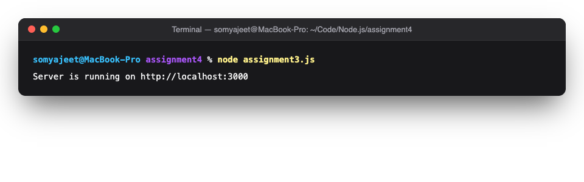
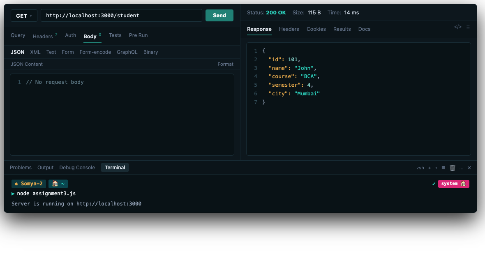
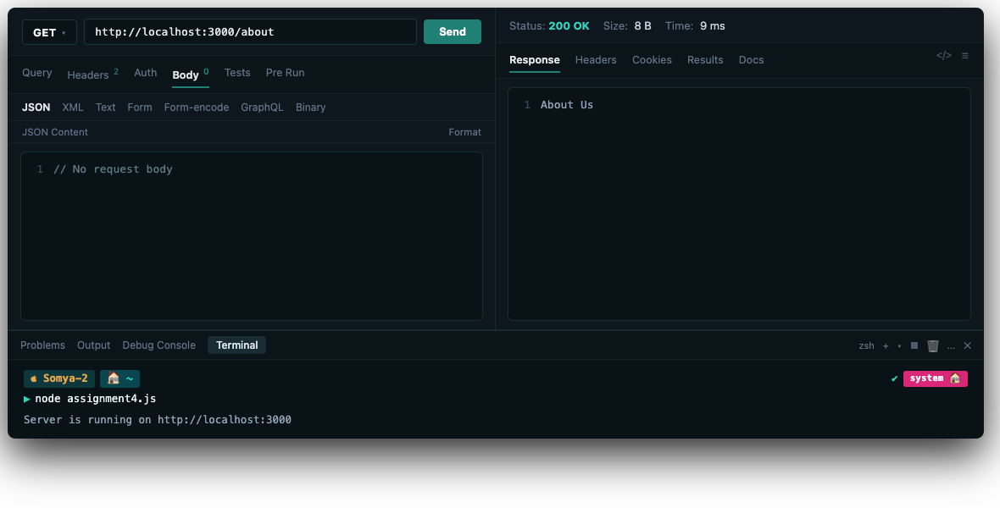

# Assignment 4: Node.js HTTP Server

**Name:** Somyajeet Singh  
**Subject:** Backend Development  
**Roll Number:** 150096725043  

---

## Assignment Explanation

This assignment explores creating basic and multi-route HTTP web servers in Node.js using the native `http` module without external frameworks.

- **assignment1.js**: Basic HTTP server returning plain text.
- **assignment2.js**: HTTP server returning HTML response (Student Portal).
- **assignment3.js**: HTTP server returning JSON data (`/student` endpoint).
- **assignment4.js**: Multi-route server handling `/`, `/about`, `/contact`, `/services`, and `404 Not Found`.
- **assignment5.js**: Interactive HTML portfolio with navigation bar.

---

## Steps to Run

1. Open terminal in `assignment4`:
```bash
cd assignment4
```
2. Run any script (for example `assignment3.js`):
```bash
node assignment3.js
```

---

## Screenshots

### 1. Terminal Server Running


### 2. Thunder Client: GET /student (JSON Response)


### 3. Thunder Client: GET /about (Route Handling)

