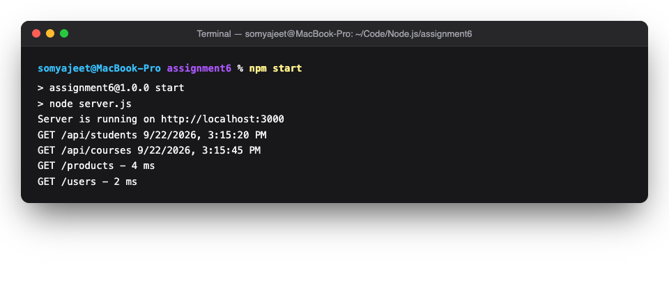
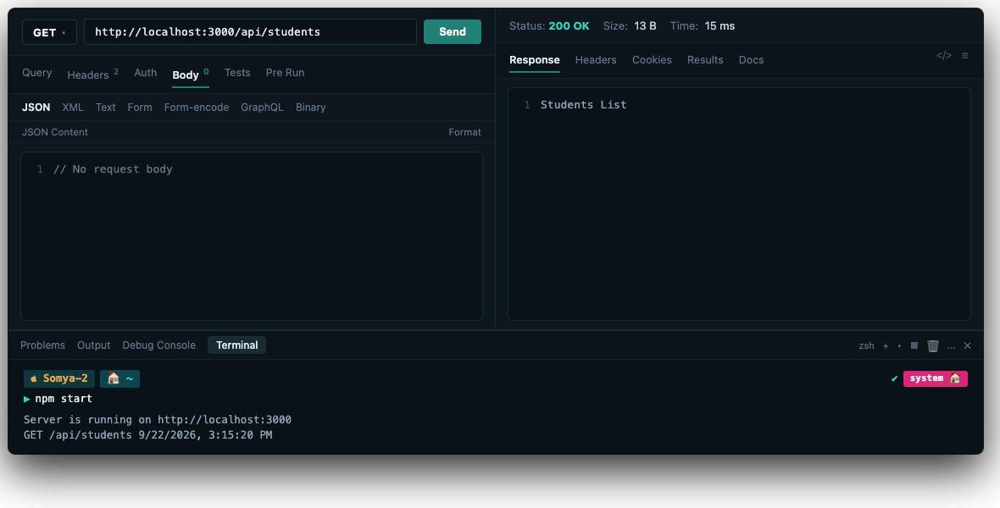
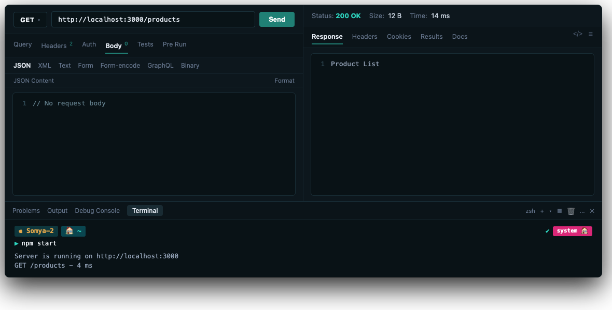

# Assignment 6: Express Middleware

**Name:** Somyajeet Singh

**Subject:** Backend Development

**Roll Number:** 150096725043

## Steps to Run

1. Open a terminal in this folder.
2. Install Express:

```bash
npm install
```

3. Start the server:

```bash
npm start
```

The server runs at `http://localhost:3000`.

## Assignment 1: Router-Level Middleware

The `routerLogger` middleware runs only for routes inside the Express Router mounted at `/api`. It logs the HTTP method, URL, and current date and time.

| Method | Route           | Response        |
| ------ | --------------- | --------------- |
| GET    | `/api/students` | `Students List` |
| GET    | `/api/courses`  | `Courses List`  |
| GET    | `/api/faculty`  | `Faculty List`  |

## Assignment 2: Request Logger Middleware

The global `logger` middleware runs before the home, about, and contact routes.

| Method | Route      | Response               |
| ------ | ---------- | ---------------------- |
| GET    | `/`        | `Welcome to Home Page` |
| GET    | `/about`   | `About Us`             |
| GET    | `/contact` | `Contact Information`  |

## Assignment 3: Response Time Middleware

The `responseTimeLogger` middleware records the request start time and logs the total response time in milliseconds.

| Method | Route       | Response       |
| ------ | ----------- | -------------- |
| GET    | `/products` | `Product List` |
| GET    | `/users`    | `User List`    |

Example terminal output:

```text
GET /api/students 9/7/2026, 10:30:45 AM
GET /about 9/7/2026, 10:31:20 AM
GET /products - 4 ms
```

---

## Screenshots

### 1. Terminal Middleware Logging Output


### 2. Thunder Client: GET /api/students (Router Middleware)


### 3. Thunder Client: GET /products (Response Time Middleware)


