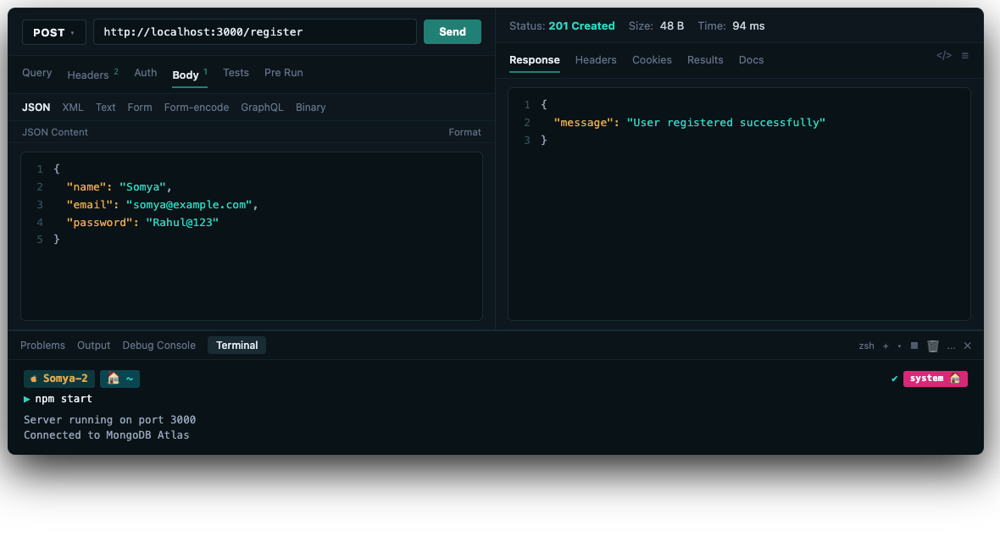
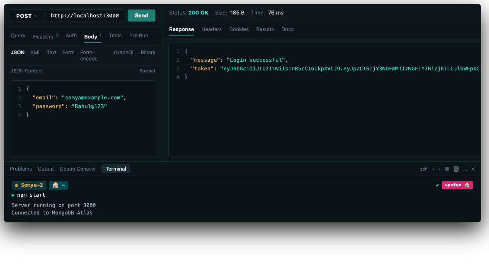
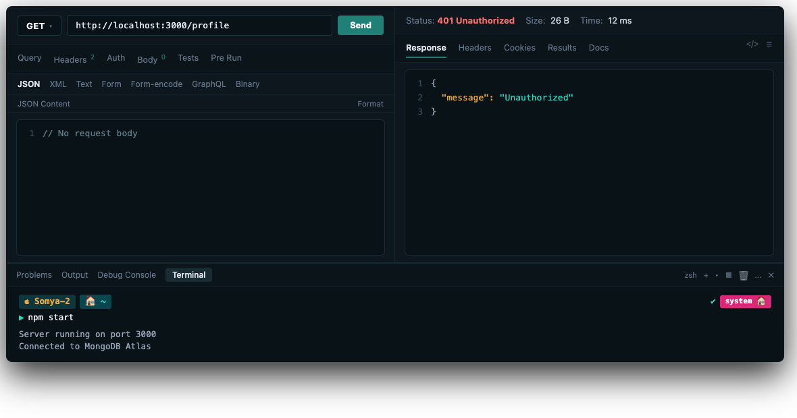
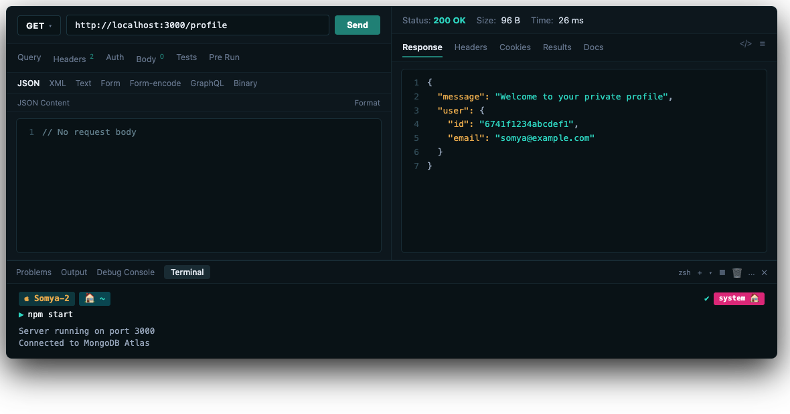

# assignment_12

**Name:** Somyajeet Singh

**Subject:** Backend Development

**Roll Number:** 150096725043

---

## Assignment: User Registration, Login & JWT Authentication Using Express.js

### Folder Structure
```text
assignment_12/
├── middleware/
│   └── authMiddleware.js
├── models/
│   └── User.js
├── .env
├── .env.example
├── .gitignore
├── package.json
├── server.js
└── README.md
```

---

## Steps to Run

1. Open terminal and navigate to the project directory:
```bash
cd assignment_12
```

2. Install dependencies:
```bash
npm install
```

3. Set up environment variables in `.env` (refer to `.env.example`):
```env
MONGO_URI=your_mongodb_atlas_connection_string
JWT_SECRET=your_jwt_secret_key
PORT=3000
```

4. Start the server:
```bash
npm start
```

Expected output:
```text
Connected to MongoDB Atlas
Server running on port 3000
```

---

## API Endpoints

### 1. Register User
- **Method:** `POST`
- **URL:** `http://localhost:3000/register`
- **Headers:** `Content-Type: application/json`
- **Body:**
```json
{
  "name": "Rahul",
  "email": "rahul@example.com",
  "password": "Rahul@123"
}
```
- **Response (201 Created):**
```json
{
  "message": "User registered successfully"
}
```

---

### 2. Login User
- **Method:** `POST`
- **URL:** `http://localhost:3000/login`
- **Headers:** `Content-Type: application/json`
- **Body:**
```json
{
  "email": "rahul@example.com",
  "password": "Rahul@123"
}
```
- **Response (200 OK):**
```json
{
  "message": "Login successful",
  "token": "JWT_TOKEN_HERE"
}
```

---

### 3. Private Profile (Protected Endpoint)
- **Method:** `GET`
- **URL:** `http://localhost:3000/profile`
- **Headers:** `Authorization: Bearer JWT_TOKEN_HERE`
- **Response (200 OK):**
```json
{
  "message": "Welcome to your private profile",
  "user": {
    "id": "USER_ID",
    "email": "rahul@example.com"
  }
}
```

- **Response without Token or Invalid Token (401 Unauthorized):**
```json
{
  "message": "Unauthorized"
}
```

---

## Postman Testing Instructions

1. **Test 1 — Register:**
   - Send `POST http://localhost:3000/register` with name, email, and password.
   - Status: `201 Created`.

2. **Test 2 — Login:**
   - Send `POST http://localhost:3000/login` with email and password.
   - Status: `200 OK`. Copy the returned `token`.

3. **Test 3 — Access Profile without Token:**
   - Send `GET http://localhost:3000/profile` without Authorization header.
   - Status: `401 Unauthorized`.

4. **Test 4 — Access Profile with Invalid Token:**
   - Send `GET http://localhost:3000/profile` with header `Authorization: Bearer invalidtoken`.
   - Status: `401 Unauthorized`.

5. **Test 5 — Access Profile with Valid Token:**
   - Send `GET http://localhost:3000/profile` with header `Authorization: Bearer <COPIED_TOKEN>`.
   - Status: `200 OK`.

---

## Screenshots

### 1. Thunder Client: POST /register (User Registration)


### 2. Thunder Client: POST /login (Login & Token Receipt)


### 3. Thunder Client: GET /profile (Without Token - 401 Unauthorized)


### 4. Thunder Client: GET /profile (With Valid Bearer Token - 200 OK)


