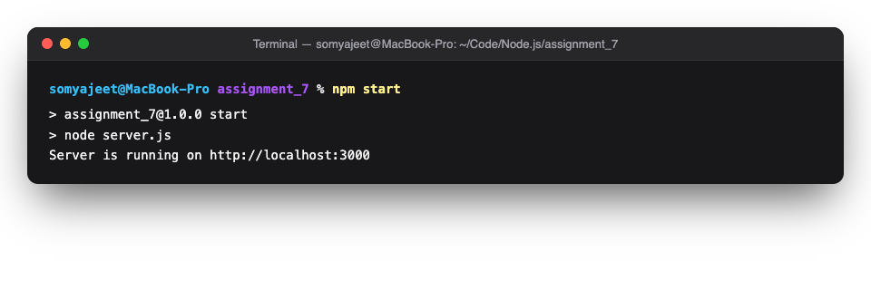
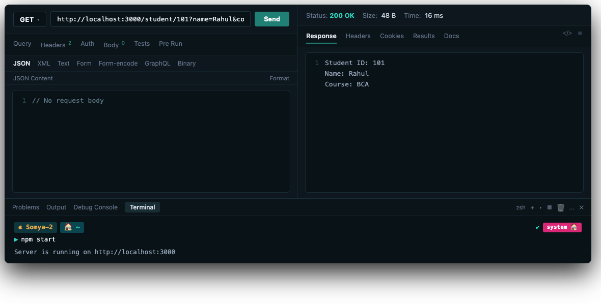
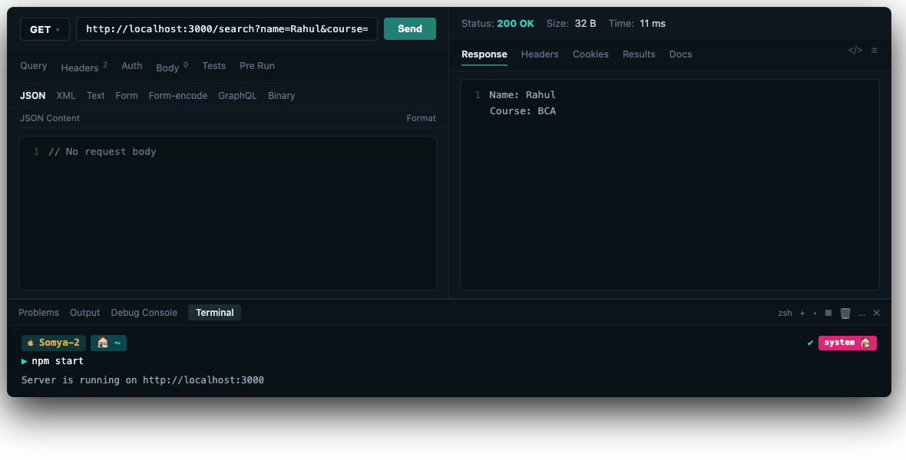

# assignment_7

**Name:** Somyajeet Singh

**Subject:** Backend Development

**Roll Number:** 150096725043

---

## Steps to Run

1. Open a terminal in this folder (`assignment_7`).
2. Install dependencies:

```bash
npm install
```

3. Start the server:

```bash
npm start
```

The server runs at `http://localhost:3000`.

---

## Endpoints and Expected Output

### Assignment 1: Route Parameters
- **URL:** `http://localhost:3000/student/101`
- **Browser Output:**
  ```text
  Student ID: 101
  ```
- **URL:** `http://localhost:3000/student/205`
- **Browser Output:**
  ```text
  Student ID: 205
  ```

### Assignment 2: Query Parameters
- **URL:** `http://localhost:3000/search?name=Ricky&course=Node.js`
- **Browser Output:**
  ```text
  Name: Ricky
  Course: Node.js
  ```
- **URL:** `http://localhost:3000/search`
- **Browser Output:**
  ```text
  No search data provided.
  ```

### Assignment 3: Student Profile using Route & Query Parameters
- **URL:** `http://localhost:3000/student/101?name=John&course=FullStack`
- **Browser Output:**
  ```text
  Student ID: 101
  Name: John
  Course: FullStack
  ```

---

## Screenshots

### 1. Terminal Server Running


### 2. Thunder Client: GET /student/:id with Query Parameters


### 3. Thunder Client: GET /search (Query Parameters)


